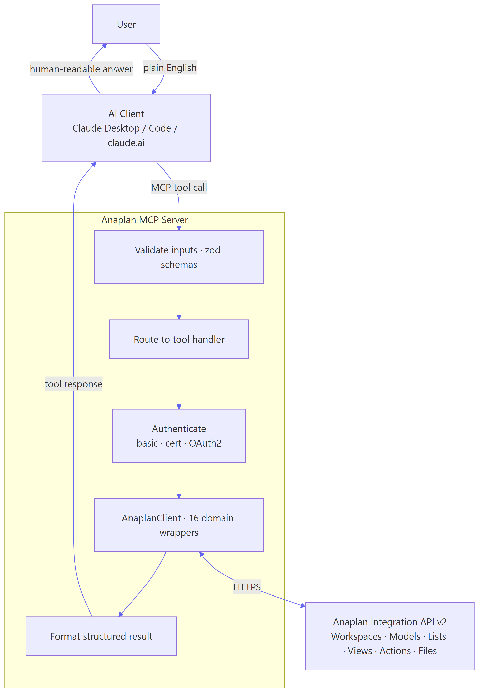
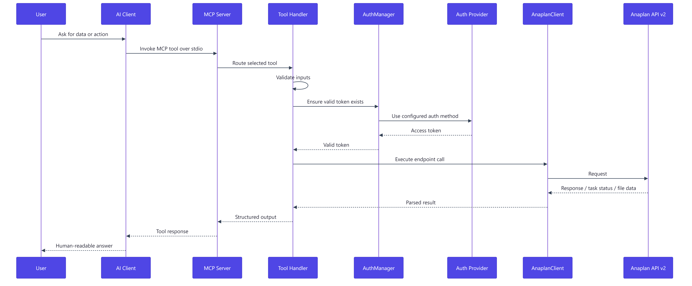
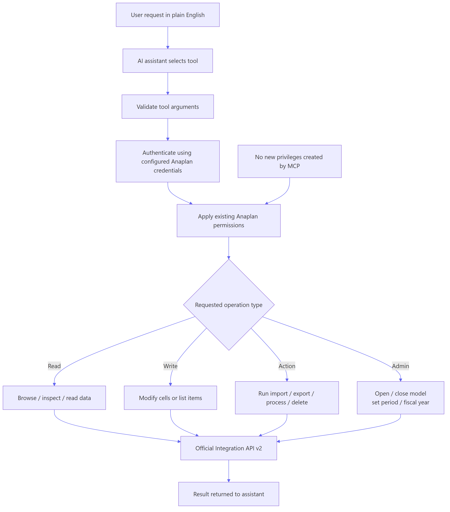

## The Problem

Anaplan's Integration API is powerful but requires serious technical expertise. Most teams rely on a handful of model builders to navigate complex models, extract data, and run imports. Everyone else waits. That bottleneck slows down data reviews, onboarding, impact analysis, and routine workflows that should be self-serve.

## The Solution: Anaplan MCP

This server wraps the entire Anaplan Integration API v2 in **70 structured tools** that AI assistants like Claude can call on your behalf. Instead of writing API calls or waiting for someone who knows the model, you ask in plain English:

> *"Show me the structure of the Supply Planning model"*
>
> *"Pull the current pricing data for all products"*
>
> *"Run the monthly demand import and show me the result"*

Built in **TypeScript** with support for both **stdio** (local) and **Streamable HTTP** (remote) transports. Works with Claude Desktop, Claude Code, claude.ai, and any MCP-compatible client.

## Who It's For

**Business users**: Stop waiting for someone to pull data or explain how a model works. Ask Claude to show you the numbers, walk you through module structure, or run your regular imports.

**Model builders and consultants**: Analyze model structure, trace formula dependencies, review line item configurations, and identify performance issues through conversation instead of clicking through hundreds of modules manually.

**IT and platform teams**: Standard API access using your existing authentication and permissions. No new credentials, no elevated access. Open source for auditability.

## What It Can Do

The 70 tools break down into three categories:

### Model Exploration (37 tools)
Browse workspaces, models, modules, lists, views, and line items. Inspect import/export/process definitions. Query users, versions, calendar settings, and task history.

### Bulk Data Operations (28 tools)
Run imports, exports, processes, and delete actions with automatic task polling. Upload and download files with chunked transfer for large datasets. Manage models: open, close, delete, set periods and fiscal year. Large-volume read requests for datasets over 1M cells.

### Transactional Operations (5 tools)
Read cell data from module views. Write values to specific cells. Add, update, and delete list items.

## Common Use Cases

**Model documentation**: Explore structure, list line items with formulas, check dimension usage, and understand how a model is composed.

**Data review**: Pull current data, identify recently added items, read forecast numbers, and get summaries without building custom exports.

**Impact analysis**: Find which modules use a specific list as a dimension, trace line-item references, and identify what a change would affect.

**Automation**: Run monthly imports, export actuals, add batches of new products to master lists, and chain multi-step workflows.

**Onboarding**: Walk new team members through module structure, explain how the model is organized, and answer questions about what each piece does.

## Built-In Orchestration Guide

The server exposes an MCP resource (`anaplan://orchestration-guide`) that AI assistants read automatically. It teaches the correct tool sequences for every workflow: navigation patterns, read/write prerequisites, bulk import lifecycles, large-volume read pagination, and list mutation flows. Every tool description also includes prerequisite hints and next-step guidance, so the AI always knows what to call and in what order.

## Engineering Highlights

- **Name resolution**: Human-readable names mapped to Anaplan IDs with case-insensitive matching and caching. Users never need to look up internal IDs.
- **Automatic task polling**: Async actions polled every 2 seconds with up to 5-minute timeout. Cancellation supported mid-flight.
- **Retry logic**: Exponential backoff for rate limits (429) and server errors (5xx).
- **Chunked uploads**: Transparent management of large file uploads in 50MB chunks.
- **Large response handling**: Automatic truncation and streaming for CSV datasets exceeding normal response limits.
- **Three-layer architecture**: Auth (pluggable providers) → API (16 domain wrappers with auto-pagination) → Tools (MCP registrations with Zod validation).

## Architecture

```
src/
  auth/       # Authentication providers (basic, certificate, oauth) + token manager
  api/        # HTTP client with retry logic + 16 domain-specific API wrappers
  tools/      # MCP tool registrations (exploration, bulk, transactional) + response hints
  resources/  # MCP resource content (orchestration guide)
  server.ts   # Wires auth > client > APIs > MCP server + registers resources
  index.ts    # Entry point
```

The auth layer supports **basic auth**, **certificate auth**, and **OAuth2** (both device grant and authorization code flows). Configuration is entirely through environment variables: no config files, no CLI flags, no settings menus.

## Compatibility

| Client | Transport | Status |
|--------|-----------|--------|
| Claude Desktop | stdio | Supported |
| Claude Code | stdio | Supported |
| claude.ai | Streamable HTTP | Supported (remote deploy) |
| Any MCP client | stdio / HTTP | Supported |

Requires Node.js 18+ and TypeScript 5.x.

## What It Can't Do

The Anaplan API does not support creating modules or line items, defining formulas, building model structure from scratch, or configuring the model calendar programmatically. For model building, use Anaplan's UI or Agent Studio. This server covers everything the Integration API v2 exposes.

## How It Works

Three views of the runtime architecture.

### High-Level Runtime Architecture

How data flows between the major subsystems during a tool call.



### Request Flow

Step-by-step sequence from user prompt to structured response.



### Trust and Control Boundary

The server maps user intent to Anaplan permissions without adding any new privileges.


