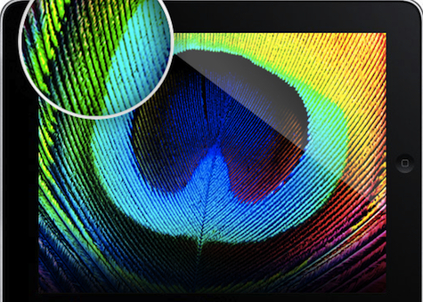

## The Problem with External Displays

If you've ever connected a standard 1080p or 1440p monitor to a Mac, you've likely noticed that the text looks "blurry" compared to the built-in Retina display. This is because macOS often fails to recognize non-Apple displays as High-DPI, denying you the crisp scaling that makes Retina displays so beautiful.

## The Solution: MacOS ex-Retina Display

This project is a **hardened and security-focused fork** of the popular HiDPI enabler script. It allows you to "trick" macOS into providing native HiDPI resolutions for your external monitor, effectively giving you a Retina experience on third-party hardware.

*Behold the detail: Retina scaling makes every pixel count.*

## Key Improvements in this Version

While many scripts exist for this purpose, this fork focuses on **security and stability**:

- **No Unsafe Permissions**: Removed dangerous `chmod 777` operations that were present in original versions.
- **Strict Validation**: Added regex-based validation for custom resolutions to prevent system misconfiguration.
- **Dependency Awareness**: Pre-flight checks ensure all required system tools are present before execution.
- **Standalone Logic**: Fully independent of external tracking or third-party servers.

## How to Use It

Setting it up is as simple as running a single script:

1. Clone the [repository](https://github.com/larasrinath/macos-hidpi).
2. Run `./hidpi.sh` in your terminal.
3. Choose your monitor and desired resolution.
4. Restart your Mac and select the new "Scaled" resolution in System Settings.

The result is a persistent, native-feeling display upgrade that makes your external monitor look like an Apple Studio Display.
