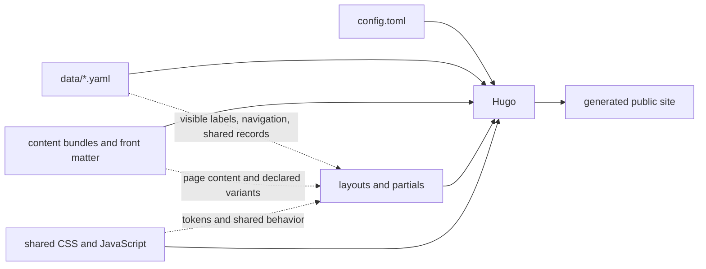

# Lara Srinath — Site Design, Architecture, and Rebuild Notes

**Status:** Living project reference  
**Last audited:** August 23, 2026  
**Applies to:** The Hugo site in this repository

This document explains what the site became, why it is built this way, how its content and presentation fit together, and what we learned while rebuilding it. It is deliberately broader than a visual style guide. It is also a content-model guide, template map, maintenance handbook, and record of the design decisions that stopped the site from drifting.

The intended audience is human first: Lara, a future collaborator, or anyone trying to understand the project without replaying months of design conversations. It is precise enough to give an AI assistant useful project context, but it does not require Codex or any other specific tool.

---

## 1. What we built

The site is a personal portfolio, résumé, project archive, and writing archive built with Hugo. Its personality comes from editorial typography, warm neutral colors, generous but controlled space, restrained motion, and a mix of professional and personal writing.

Underneath that appearance is a deliberate system:

- Hugo owns content assembly and page generation.
- YAML data files and page front matter own visible content and configuration.
- Shared templates own structure.
- Shared CSS tokens own typography, color, spacing, dividers, and interaction behavior.
- Page-specific code is reserved for genuinely different behavior, not ordinary visual variation.
- There is no separate CMS.
- Generated HTML is an output, never a source of truth.

The main achievement was not merely a new look. It was replacing a collection of accumulated page treatments with one maintainable presentation language.

## 2. The story of the rebuild

The original website began as a fun project and grew for roughly six years. During that time it accumulated several ways of doing the same thing:

- pages rendered through different toolchains;
- RStudio and Blogdown-era files;
- copied or generated HTML;
- multiple visual themes;
- page-level CSS fixes;
- inconsistent fonts, weights, spacing, image treatments, and dividers;
- duplicate images and abandoned reference folders;
- content that was present in the source but missing from the rendered site.

Each individual addition was understandable. Together they created a site that behaved like several sites sharing one domain.

The rebuild therefore followed two parallel goals:

1. **Create one recognizable personal design.**
2. **Make that design difficult to accidentally fragment again.**

The second goal is why so much of the current work lives in shared templates, YAML, and design tokens. Consistency is not maintained by remembering every pixel. It is maintained by giving ordinary changes one correct place to happen.

## 3. The governing rule

> Content describes what a page says. Templates describe what that kind of page is. Design tokens describe how the whole site looks and behaves.

In practice:

- If text, a label, a link, a date, a tag, or an image may change with content, store it in YAML/front matter/content.
- If markup repeats across pages, make it a Hugo template or partial.
- If a visual value repeats across components, make it a CSS custom property or a shared class.
- If one page truly needs different behavior, declare the exception in content and implement it through a named template path or component.
- Do not edit generated files under `public/` or `resources/`.

This rule is the simplest test for whether a proposed change belongs in the system.

## 4. How the system fits together



The important boundary is between the inputs and the generated site. All durable edits belong on the left side of this diagram.

## 5. Sources of truth

| Concern | Primary source | Notes |
|---|---|---|
| Site identity, Hugo settings, taxonomies | `config.toml` | Keep this concise; do not duplicate content-specific settings here. |
| Global UI labels and pagination language | `data/ui.yaml` | Also contains footer, accessibility, article, project, selector, and 404 labels. |
| Navigation, home name, portrait, social links | `data/home.yaml` | Shared header and footer both consume this data. |
| Professional experience and capabilities | `data/experience.yaml` | Reused where experience is presented. |
| Résumé summary, highlights, skills, selected work, credentials | `data/resume.yaml` | The résumé is data-driven rather than a standalone HTML document. |
| About copy | `content/about/` | The main and sidebar content are separate Hugo content records. |
| Blog and project content | `content/blog/`, `content/project/` | Page bundles keep content and relevant media together. |
| Shared page grammar | `layouts/partials/shared/` | Hero, content start, tail, pagination, and shared experience. |
| Article/project grammar | `layouts/partials/article/` | Detail hero, rail, structured body, images, actions. |
| Visual system | `assets/css/lara-theme.css` | Master palette, typography, dimensions, spacing, dividers, and responsive rules. |
| Site behavior | `assets/js/custom.js` | Mobile navigation, progress, and share-menu behavior. |
| Build and deployment | `DEVELOPMENT.md`, `netlify.toml` | Hugo version and production commands live here. |

`docs/CONTENT-MODEL.md` is the concise content-authoring contract. This document explains the broader design and architecture around it.

## 6. Page families

The site has several page families, but they share a vocabulary.

| Family | Purpose | Primary templates | Distinctive behavior |
|---|---|---|---|
| Home | Minimal identity landing page | `layouts/index.html` | Portrait and name only; intentionally not a dashboard. |
| Section home | Projects, Blog, Talks, taxonomies | `layouts/*/list*.html` | Shared hero, repeatable list rows/cards, optional pagination. |
| Informational page | About, Résumé, 404 | Section-specific layout plus shared page head/tail | Uses the same page rhythm without pretending all content is the same. |
| Detail page | A blog post or project | `layouts/blog/single.html`, `layouts/project/single.html` | Text-only detail hero, editorial rail, structured body, next entry. |
| Declared exception | A project with real interactive needs | Shared detail system plus named component | Must be content-declared and documented. |

### One system does not mean one identical template

Early in the process, consistency was sometimes interpreted as making every page use the same composition. That produced awkward empty space and weak hierarchy. The corrected principle is:

> Pages should share design grammar, not necessarily identical sentences.

For example, the About page and Projects page can use the same typography, divider, shell, and content-start rules while still arranging their content differently.

## 7. Visual design system

### 7.1 Design character

The design is editorial, personal, calm, and technically precise. It should feel closer to a well-composed independent journal than a SaaS marketing template.

The site avoids:

- glossy cards everywhere;
- decorative arrows appended to ordinary links;
- excessive badges;
- arbitrary gradients;
- multiple competing type systems;
- animation used only to make the page feel busy;
- empty space that has no compositional job.

### 7.2 Master palette

The palette is centralized in `:root` inside `assets/css/lara-theme.css`.

| Token | Current value | Role |
|---|---:|---|
| `--paper` | `#f5f0e8` | Light surface, detail areas, content bands. |
| `--paper-deep` | `#ede6d9` | Global canvas and slightly deeper listing areas. |
| `--canvas` | `var(--paper-deep)` | Default page background. |
| `--surface` | `var(--paper)` | Raised or contrasting page section. |
| `--ink` | `#1b1712` | Primary text. |
| `--ink-soft` | `#4d463c` | Body and secondary text. |
| `--muted` | `#6c6459` | Metadata and low-emphasis text. |
| `--accent` | `#9c3d1e` | Terracotta emphasis, links, italic display words. |
| `--line` | `#d8cfc0` | Dividers and outlines. |

The palette was intentionally reduced to two warm surfaces plus ink, muted text, accent, and line. Page variety comes from composition and typography rather than unrelated background colors.

#### Platform colors

The Anaplan MCP project has a declared platform-aware setup guide. Its OS selector may temporarily apply:

- Windows: `#0078d4`
- macOS: `#86868b`
- Linux: `#e95420`

This is a functional exception, not permission for ordinary pages to invent new palettes. The page defaults to the project’s intended selector state and changes only through an explicit user selection.

### 7.3 Typography

The site self-hosts its fonts and gives each one a specific role.

| Family | CSS name | Role |
|---|---|---|
| Fraunces | `Lara Demo Fraunces` | Display titles, editorial headings, serif emphasis. |
| Inter | `Lara Demo Inter` | Navigation, metadata, controls, body copy. |
| Mea Culpa | `Lara Mea Culpa` | The distinctive scripted surname/initial accent only. |

The governing typography rules are:

- Use Fraunces for identity and major editorial hierarchy.
- Use Inter for readable content and interface language.
- Use the script face sparingly; its rarity gives it meaning.
- Use weight before adding another typeface.
- Do not approximate the system with a similar web font on one page.
- Preserve italics and emphasis from content; they are part of the editorial voice.

The shared editorial italic token is:

```css
--editorial-italic: italic 400 1.5rem/1.333333 var(--serif);
```

Excessive bold text was removed during the rebuild because it made every sentence compete for attention. Bold should identify a key phrase, not act as default decoration.

### 7.4 Shells and reading widths

The site uses a small set of width tokens:

```css
--shell: 1152px;
--shell-content: 1104px;
--shell-gutter: 24px;
--listing-content: 1000px;
--reading: 800px;
```

- `--shell` controls the main alignment frame.
- `--listing-content` keeps archive pages readable instead of stretching across wide monitors.
- `--reading` protects long-form body copy from becoming tiring.
- Header and footer dividers are full-bleed even when their inner content uses the shell.

This last distinction matters: content aligns to a centered shell; structural dividers may extend edge to edge.

### 7.5 Spacing rhythm

Spacing is semantic. The current master content transitions are:

```css
--page-content-start-space: 4rem;
--page-content-start-compact-space: 3rem;
--page-content-start-detail-space: 2rem;
--page-tail-space: 2rem;
```

On small screens they reduce to approximately:

- standard content start: `3rem`;
- compact content start: `2.25rem`;
- detail content start: `1.5rem`;
- page tail: `1.5rem`.

These are not empty spacer sections with arbitrary height. They are shared transition tokens applied by `page-content-start.html` and `page-tail.html`.

#### Spacing tests

When evaluating a gap, ask:

1. Does it separate different levels of hierarchy?
2. Is it controlled by content flow or by a fixed/minimum height?
3. Does it become larger as the viewport becomes smaller?
4. Would the layout still make sense if the preceding content were shorter?

If the answer to the third question is yes, the responsive rule is probably wrong. If the gap exists only because of `min-height`, it is almost certainly wrong.

### 7.6 Dividers

All structural dividers use one master definition:

```css
--site-divider-width: 1px;
--site-divider-color: var(--line);
--site-divider: var(--site-divider-width) solid var(--site-divider-color);
```

The site-header divider is the baseline. Section, pagination, and footer dividers should match it unless a component has a documented semantic reason not to.

Rules:

- Use one divider between adjacent repeated items, not one on every side of every item.
- Preserve the section divider below a list-page hero.
- Do not make dividers thicker on mobile.
- Do not stop global header/footer rules at the content shell on wide monitors.
- Media backplates are not dividers; their color and opacity are controlled separately.

### 7.7 Heroes

The site has two related hero grammars.

#### Section and informational heroes

Rendered through `layouts/partials/shared/page-hero.html` and normally invoked by `page-head.html`.

They may contain:

- eyebrow;
- concise display title with one emphasized word;
- supporting copy aligned within the shared grid;
- a full-width section divider.

The headline should be short enough to remain composed. Supporting copy should not become a second competing headline.

#### Detail heroes

Rendered through `layouts/partials/article/detail-hero.html`.

They contain:

- back link;
- content type and date;
- title;
- summary and tags.

They are always text-only. A feature image never appears inside the hero.

Current desktop detail-hero rhythm is approximately `9rem` top, `3.5rem` bottom, with a responsive `7rem`/`2.5rem` mobile treatment. Any further adjustment should happen in the shared detail-hero rules, not in one post.

### 7.8 Body content

The editorial detail layout is a 12-column grid:

- the rail occupies the left columns;
- the prose occupies the main reading columns;
- prose remains capped near `800px`;
- the rail may be sticky when the viewport allows it;
- mobile collapses into a single readable flow.

Typical long-form body settings:

- body paragraph: Inter at roughly `1.125rem` with a generous `1.85` line height;
- second-level heading: about `4rem` top separation;
- third-level heading: about `3rem` top separation;
- prominent quote: about `3rem` vertical space.

The values are shared. Individual articles should not add empty HTML blocks to simulate rhythm.

### 7.9 Images

The site follows a strict image contract:

1. A detail page may have at most one feature image.
2. The feature image appears at the top of the body, immediately after the opening content.
3. The feature image receives the editorial backplate treatment.
4. Later images are secondary and render without the feature backplate.
5. The detail hero never contains an image.
6. Images are generated responsively as WebP variants when possible.
7. Feature media loads eagerly; secondary media loads lazily.

The responsive image partial currently creates widths around 360, 640, 960, 1280, and 1600 pixels. The home portrait uses its own smaller responsive set and viewport-aware `sizes` rule.

The backplate is controlled by shared media tokens. When the palette changes, inspect it explicitly; palette inversion once made the frame visually dominate the image.

### 7.10 Motion and hover

Motion is small and informative.

- Header links shift by the global `--header-link-shift: .2rem` on hover.
- Repeated list titles may use the same family of subtle movement.
- Resource and share controls use a solid highlight state rather than a positional jump.
- Touch devices disable hover behavior to avoid sticky post-tap states.
- `prefers-reduced-motion` is respected.

Do not add hover-only meaning. Every control must remain understandable and usable without hover.

### 7.11 Mobile navigation

The shared mobile header uses a three-line hamburger.

Behavior in `assets/js/custom.js`:

- the button opens and closes the menu;
- selecting a menu link closes it;
- tapping outside closes it;
- Escape closes it and returns focus;
- crossing back to the desktop breakpoint resets the menu state.

This behavior belongs to the shared header. A page should never implement its own mobile navigation.

### 7.12 Footer

The footer is a single shared component.

Desktop composition:

- social icons on the left;
- copyright in the center;
- license on the right.

Small-screen composition intentionally becomes three rows, not an accidental two-row wrap. GitHub serves both as a profile link and the link to the site source; a redundant “Source code” text link was removed.

The top divider is full-bleed and uses the global divider token.

## 8. Content architecture

### 8.1 No separate CMS

Content is edited through the repository:

- shared records in `data/*.yaml`;
- page-specific front matter in Markdown files;
- prose or structured body blocks in page bundles;
- media stored with the bundle when it belongs to that page.

This provides a clear change history, keeps the site portable, and lets an AI assistant add a project or post without altering the layout system.

### 8.2 Shared data versus page front matter

Use a data file when a record is reused or site-wide:

- navigation;
- social links;
- UI labels;
- professional experience;
- résumé records.

Use front matter when a value belongs to one page:

- title and summary;
- date;
- tags and categories;
- feature image and caption;
- resource links;
- detail-rail note;
- article body blocks;
- an explicitly declared special behavior.

### 8.3 Structured body blocks

The shared article renderer understands the following block types:

- `opening`
- `paragraph`
- `heading`
- `image`
- `quote`
- `list`
- `callout`
- `cta`
- `equations`
- `code`
- `chart`
- `page_content`
- `signoff`

This schema lets a blog or project create rich editorial rhythm without embedding page-specific HTML.

The renderer also guarantees the feature-image contract by moving the first declared image to the appropriate position after the opening.

### 8.4 Resource links and actions

Project links are declared in content with labels, URLs, and icon metadata. The shared action renderer decides how they look.

Examples:

- GitHub → GitHub icon;
- live website → globe/web icon;
- setup guide → open-book icon;
- résumé PDF → download icon;
- share → platform-native share glyph with LinkedIn/X choices in its menu.

This prevents each page from inventing a different button size or icon alignment.

### 8.5 Tags and taxonomy

Taxonomies are declared in `config.toml` and rendered through shared taxonomy layouts. Tags should be normalized at the content layer:

- prefer one spelling for “Data Visualization”;
- distinguish `R` from `R Shiny` only when both are meaningful;
- avoid near-duplicate plural/case variants;
- treat tags as navigation, not decoration.

### 8.6 Pagination and next-entry order

Global pagination is configured in `config.toml`; a section may declare its display size in front matter when appropriate. Shared pagination markup and labels live in the shared partials and `data/ui.yaml`.

Detail navigation moves from newer content toward older content. It must not fall back in the opposite direction at the end of the sequence, because that creates a two-page loop.

### 8.7 Legitimate exceptions

An exception is allowed when the content needs a capability the ordinary editorial schema cannot express cleanly.

Current examples:

- the Anaplan MCP OS/auth-aware setup guide;
- the Lorenz chart component.

An exception must still:

- use the shared page shell, typography, palette, rail, and actions;
- be invoked from content or a named component;
- degrade sensibly on mobile;
- be documented;
- avoid silently changing the behavior of ordinary posts/projects.

The MCP page also uses `page_content`/Markdown for a long technical guide. That is a conscious exception, not the default authoring model.

## 9. Template map

### Site frame

- `layouts/_default/baseof.html` — document frame.
- `layouts/partials/head.html` — head assembly.
- `layouts/partials/meta.html` — metadata.
- `layouts/partials/header.html` — global header and navigation.
- `layouts/partials/footer.html` — global footer.

### Shared page grammar

- `layouts/partials/shared/page-head.html`
- `layouts/partials/shared/page-hero.html`
- `layouts/partials/shared/page-content-start.html`
- `layouts/partials/shared/page-tail.html`
- `layouts/partials/shared/pagination.html`
- `layouts/partials/shared/experience.html`

### Editorial/detail grammar

- `layouts/partials/article/detail-hero.html`
- `layouts/partials/article/detail-rail.html`
- `layouts/partials/article/detail-actions.html`
- `layouts/partials/article/body.html`
- `layouts/partials/article/image.html`
- `layouts/partials/components/resource-action.html`

### Page-family templates

- `layouts/index.html`
- `layouts/about/list.html`
- `layouts/resume/single.html`
- `layouts/blog/list-grid.html`
- `layouts/blog/single.html`
- `layouts/project/list-grid.html`
- `layouts/project/single.html`
- `layouts/talk/list.html`
- taxonomy layouts under `layouts/_default/`
- `layouts/404.html`

### Declared special components

- `layouts/partials/project/lorenz-chart.html`
- the MCP selector/guide components referenced by its project template/content.

## 10. Editorial voice

The design depends on the copy sounding like the same person.

### Preferred voice

- personal but not self-mythologizing;
- professional but not corporate boilerplate;
- specific rather than grand;
- confident without excessive emphasis;
- technically credible without turning every page into documentation.

### Content hierarchy

When describing professional work:

1. Lead with supply chain planning.
2. Then cover material, production, demand, inventory, and integrated planning as relevant.
3. Include FP&A/finance after the supply-chain focus.
4. Describe platforms and tools in service of outcomes.

### Typography in copy

- Do not bold an entire inventory of capabilities.
- Use italics for voice, quotations, and a restrained personal aside.
- Use the accent link color sparingly.
- Prefer a concise “in brief” section over a full biography before the page begins.
- Personal references should feel natural, not like taglines added to every surface.

## 11. What went wrong, and what it taught us

| Symptom | Root cause | Guardrail now |
|---|---|---|
| Pages looked like two or more themes | Theme CSS and page-specific treatments coexisted | One project-owned presentation layer and one font system. |
| Blog posts lost images, code, or half their content | Rendered HTML was copied instead of migrating source content | Markdown/YAML is authoritative; generated HTML is disposable. |
| A fix worked on one page but not another | The edit targeted standalone markup or a narrow selector | Repeated UI must be a partial/component with shared CSS. |
| Fonts, weights, and alignment kept drifting | Similar-looking values were guessed per page | Self-hosted fonts plus shared typography roles. |
| Hero and section gaps became enormous | Fixed/minimum heights were used as layout | Content-flow spacing tokens; no empty height to fill a viewport. |
| Mobile gaps grew as screens shrank | Responsive sizing formula moved in the wrong direction | Test the smallest supported widths, not only one phone preset. |
| Project images cropped or overflowed | Static dimensions and `object-fit` assumptions | Responsive image partials and explicit feature/secondary roles. |
| Image frames became too strong after a palette change | Backplate colors were coupled to old surfaces | Dedicated media tokens and an image QA pass after palette edits. |
| Dividers changed thickness or stopped before the edge | Multiple border declarations and shell-bound structure | One divider token; full-bleed frame dividers with shell-bound content. |
| Hover remained after a tap | Hover styles had no coarse-pointer override | Disable hover treatments for touch/coarse pointers. |
| Action links had different boxes and overlapping icons | Each action was styled individually and icons were positioned ad hoc | Shared resource-action component with one size contract. |
| “Up next” bounced between two pages | End-of-sequence fallback reversed direction | One-way newer-to-older navigation with no reverse fallback. |
| Icons declared in YAML did not render | The shared rail ignored `icon`/`icon_pack` | Action renderer consumes the content schema directly. |
| Header identity shifted between pages | Home and internal pages used different frame measurements | One shared header template and shell. |
| Footer became two accidental lines | Natural wrapping was treated as the mobile layout | Explicit one-row desktop and three-row mobile compositions. |
| Tags such as Data Viz/Data Visualization duplicated | Taxonomy values grew without normalization | Normalize tags in front matter and audit terms. |
| The repository became heavy and confusing | Demo themes, duplicate media, generated assets, and old IDE files remained | Keep only source assets in use; ignore generated output; audit images. |
| README stopped working as a GitHub profile | Technical setup overwhelmed the public introduction | README remains portfolio-facing; technical detail goes in DEVELOPMENT/docs. |
| A special page silently changed the site’s default theme | Platform detection was treated as global styling | Exceptions are scoped and activated only through declared state. |
| Too much bold made the page visually noisy | Emphasis was used as decoration | Emphasize only the few phrases that carry hierarchy or meaning. |

## 12. How to make common changes safely

### Change a global color

1. Edit the relevant root token in `assets/css/lara-theme.css`.
2. Check canvas, surface, text contrast, dividers, media backplates, and action outlines.
3. Test at least Home, About, a section list, a blog detail, and a project detail.
4. Do not override the new color separately in each page template.

### Change global page spacing

1. Decide whether it is a content start, compact start, detail start, tail, section, or component gap.
2. Edit the semantic token/shared class.
3. Test short and long pages.
4. Test wide desktop and narrow mobile.
5. Search for an old page-specific selector that may still compete.

### Add a blog post

1. Create a page bundle under `content/blog/`.
2. Fill the established front matter fields.
3. Compose the body with supported structured blocks.
4. Declare one feature image at most.
5. Add resource links only through the links schema.
6. Build; do not edit the blog template.

### Add a project

1. Create a page bundle under `content/project/`.
2. Use normalized tags and a concise excerpt/summary.
3. Declare GitHub, live site, or guide links with icon metadata.
4. Use the shared project body schema.
5. Add a special component only if the project truly needs behavior unavailable to the shared renderer.

### Change navigation or social links

- Edit `data/home.yaml`.
- Header/footer templates should not need to change.

### Change UI wording

- Look first in `data/ui.yaml`.
- Keep labels out of CSS and avoid repeating them across templates.

### Change professional history

- Update `data/experience.yaml` and, if résumé-only detail changes, `data/resume.yaml`.
- Verify every page that reuses the record.

### Add a new body component

1. Confirm that existing blocks cannot express it.
2. Give the block a clear semantic name.
3. Add rendering to the shared body partial or a named component partial.
4. Define a YAML/front-matter schema.
5. Add responsive, keyboard, and reduced-motion behavior as applicable.
6. Document it in `docs/CONTENT-MODEL.md` and here.

## 13. Quality checklist

### Build

- [ ] Run `hugo server` for local review.
- [ ] Run the strict production validation command from `DEVELOPMENT.md`.
- [ ] Confirm there are no missing resources or path warnings.
- [ ] Confirm Netlify’s pinned Hugo version still matches local expectations.

### Content and templates

- [ ] New content renders from YAML/front matter without editing generated HTML.
- [ ] Shared copy comes from the correct data file.
- [ ] A repeated pattern uses a partial/component.
- [ ] Tags are normalized.
- [ ] No content was lost from the source bundle.

### Layout

- [ ] Header identity does not shift between page families.
- [ ] Header and footer dividers reach the viewport edges.
- [ ] Section dividers use the master 1px rule.
- [ ] Content start and tail spacing use shared modes.
- [ ] No fixed/min-height creates a large empty band.
- [ ] Reading text remains within its max width.

### Responsive

- [ ] Test wide desktop, laptop, tablet, and at least two phone widths.
- [ ] Portrait and feature images resize without cropping important content.
- [ ] Mobile name/portrait order remains intentional.
- [ ] Footer is one row or three rows, never an accidental two.
- [ ] Mobile action controls are centered and do not overlap.
- [ ] Menu closes on outside tap and Escape.

### Interaction and accessibility

- [ ] Every interactive element has a visible focus state.
- [ ] Hover is not required to understand or use a control.
- [ ] Touch devices do not retain hover styling.
- [ ] Reduced-motion preferences are respected.
- [ ] Icons have accessible names; decorative icons are hidden from assistive technology.
- [ ] Share menus manage `aria-expanded` and keyboard dismissal.

### Editorial details

- [ ] Detail hero is text-only.
- [ ] There is at most one feature image and it starts the body.
- [ ] Secondary images do not receive the feature backplate.
- [ ] Body headings and quotes use the shared rhythm.
- [ ] Bold and accent color are used sparingly.
- [ ] “Up next” proceeds newer to older without looping.

## 14. Non-negotiable guardrails

1. Do not edit generated HTML in `public/`.
2. Do not introduce a second theme.
3. Do not add a font for one page without revisiting the global type system.
4. Do not solve ordinary spacing with fixed heights.
5. Do not hardcode shared content in a page template.
6. Do not add page-specific CSS for a component already shared elsewhere.
7. Do not put an image in a blog/project detail hero.
8. Do not give multiple images the feature treatment.
9. Do not rely on hover on mobile.
10. Do not add an exception without naming, scoping, and documenting it.
11. Do not restore unused demo themes, RStudio project files, or duplicate media.
12. Do not turn the public README into the full developer manual.

## 15. Repository and deployment conventions

- The project is Hugo Extended, currently pinned to version `0.165.0` in Netlify.
- Netlify publishes `public/` and runs Hugo with garbage collection and minification.
- Deploy previews may build future-dated content; normal branch/production builds follow their configured modes.
- The canonical strict local command lives in `DEVELOPMENT.md`.
- Sitemap generation is handled by Hugo.
- Keep build output and caches out of version control.

## 16. Using this document with people or AI

For a human collaborator, start with sections 1–7, then use the recipes and checklist.

For an AI assistant, provide this document together with:

- `docs/CONTENT-MODEL.md`;
- the relevant YAML data file;
- the relevant page-family template;
- `assets/css/lara-theme.css`.

Then ask it to identify the shared source of truth before changing code. A good change proposal should be able to answer:

1. Which content file owns the value?
2. Which template owns the markup?
3. Which shared token/class owns the presentation?
4. Which page families will inherit the change?
5. What responsive and accessibility states were tested?

This document could later be packaged as a reusable Codex skill, but the Markdown file is the canonical knowledge source. Keeping the knowledge human-readable prevents it from becoming trapped inside one tool.

## 17. Final perspective

The website is intentionally simple at the surface and structured underneath. That is the main lesson of the rebuild.

The earlier site became difficult because every new idea could create a new visual or technical path. The current site works because new content travels through established paths: YAML/front matter, Hugo templates, shared components, and global design tokens.

The goal is not to prevent the site from evolving. It is to let it evolve without forgetting what it already learned.
